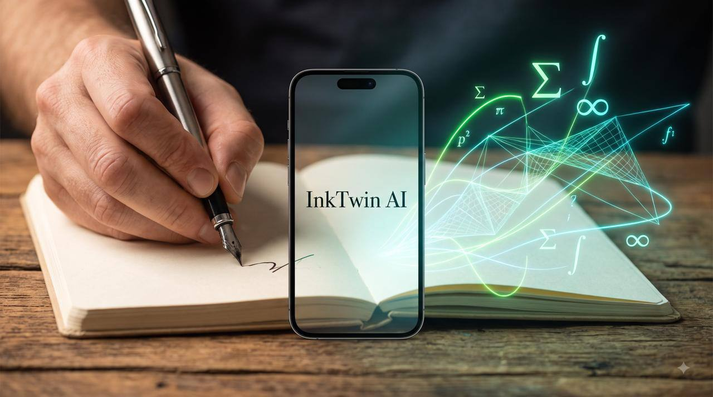
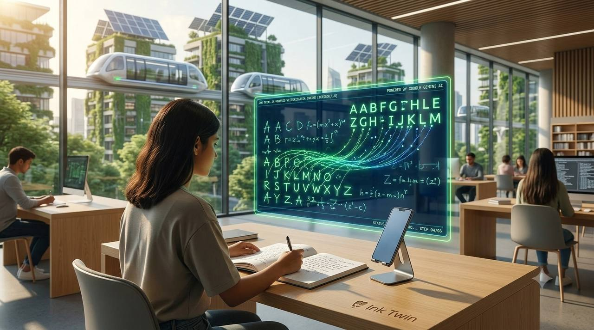
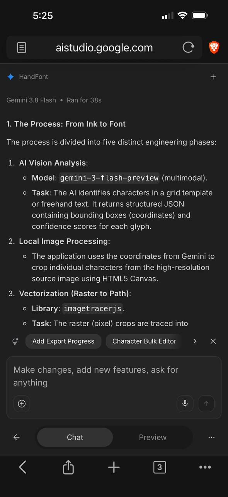

<div align="center">

# 🖋️ InkTwin (Ink-Twin)

### **The #1 Free AI Web App for Text to Handwriting & Handwriting-to-Font Creation**
#### *AI Study Helper & Homework Solver That Writes Assignments in Your Exact Personal Handwriting*

[](./LICENSE)
[](https://www.typescriptlang.org/)
[](https://reactjs.org/)
[](https://vitejs.dev/)
[](https://tailwindcss.com/)
[](#-privacy--security)

**[🌐 Launch Free Web App: inktwin.primuez.in](https://inktwin.primuez.in)**

</div>

---

## 📖 Overview

**InkTwin** (also known as **Ink Twin** or **Ink-Twin**) is an open-source, mobile-first AI studio designed to bridge digital text with natural handwriting. 

Whether you need to **convert text to realistic handwritten notes**, **create a custom downloadable `.ttf` font from your own handwriting**, or use an **AI study helper to solve homework and write assignments in your personal handwriting**, InkTwin handles the entire pipeline 100% client-side with zero desktop installation.

---

## ✨ Core Features & Search Capabilities

### 1. 📝 Text to Realistic Handwriting Generator
* **Authentic Paper Textures**: 20+ notebook backgrounds including single-ruled, blue-ruled, legal pad, grid, vintage parchment, and blank paper.
* **Natural Ink Physics**: Realistic ink bleed, pen pressure variation, baseline wobble, letter spacing, and line jitter.
* **Ink Customization**: Royal blue, gel pen black, ballpoint, pencil graphite, and custom RGB colors.
* **Multi-Page Assignment Export**: Instant high-resolution PDF and PNG exports ready for school, university, or work submissions.

### 2. ✏️ Handwriting to Font Creator (.TTF)
* **Photo to Font**: Snap a smartphone photo of your handwriting sample or printable A4 grid template.
* **Touchscreen Drawing Pad**: Draw or tweak individual missing letters/glyphs directly using finger or stylus on mobile or iPad.
* **100% Client-Side Vectorization**: Bezier curve extraction via `imagetracerjs` and instant TrueType font assembly via `opentype.js`.
* **Universal Compatibility**: Download your real `.ttf` font and use it in MS Word, Google Docs, Canva, Photoshop, or InkTwin Writer.

### 3. 🎓 AI Study Helper & Homework Solver in Your Handwriting
* **Instant Problem Solving**: Snap a photo of your math, science, or essay questions, or paste the assignment prompt.
* **Step-by-Step AI Solutions**: Solves equations, writes code, drafts essays, and explains proofs using Google Gemini Multimodal AI.
* **1-Tap Handwriting Transfer**: Sends solved answers directly to Studio Writer to render them automatically onto ruled paper in your personal handwriting.

### 4. ✨ AI Text Humanizer (Student Tone Personas)
* Removes robotic AI sentence structures and converts text into authentic student phrasing.
* Personas: High School Student, College Researcher, Casual Learner, Detailed Explainer.

### 5. 🔍 Find My Font (Style Matcher)
* Upload any handwriting sample to instantly find the closest free matching web fonts.

---

## 🏛️ Reimagining the Smart City with Google Gemini

<div align="center">
  
  <p><em>Official Campaign Poster: InkTwin ambient homework & STEM spatial vectorization companion.</em></p>
</div>

<div align="center">
  
  <p><em>InkTwin ambient learning station in a sustainable smart city hub — bridging physical handwriting with Google Gemini AI vectorization.</em></p>
</div>

### Civic & Educational Impact
* **Preserving Human Individuality**: In a future filled with sterile digital screens and homogenized synthetic fonts, InkTwin empowers citizens and students to retain their physical handwriting identity as a personal digital asset.
* **Accessible Civic Literacy**: Bridges analog paper and digital systems for students, elderly residents, and non-technical citizens without requiring expensive hardware.
* **Powered by Google Gemini**: Built and verified in **Google AI Studio** leveraging multimodal spatial reasoning:
  - **`gemini-3-flash-preview`**: Spatial glyph bounding box detection and handwriting segmentation from camera snaps.
  - **`gemini-2.0-flash`**: Step-by-step homework reasoning, STEM problem solving, and student voice humanization.

<div align="center">
  
  <p><em>Google AI Studio pipeline verification with Gemini 3.8 Flash and gemini-3-flash-preview.</em></p>
</div>

---

## 🚀 Quick Start & Deployment

### Local Development

```bash
# Clone the repository
git clone https://github.com/Primmius/Ink-Twin.git
cd Ink-Twin

# Install dependencies
npm install

# Start development server
npm run dev
```

### Production Build

```bash
npm run build
```

---

## 🔒 Privacy & Security

* **100% Client-Side Processing**: All vectorization, glyph extraction, and `.ttf` font compilation run locally inside your browser sandbox.
* **Zero Cloud Storage of Handwriting**: Your personal handwriting samples never touch remote servers.
* **Bring Your Own Key (BYOK)**: AI Homework features connect directly to your Gemini API key from the browser.

---

## 👤 Author & Credits

Created and maintained by **[Primuez (Rahul Kasturiya)](https://primuez.in)**.

* **Portfolio:** [primuez.in](https://primuez.in)
* **GitHub:** [@Primuez](https://github.com/Primuez) | [@Primmius](https://github.com/Primmius)
* **YouTube:** [@Primuez](https://youtube.com/@primuez)
* **Twitter / X:** [@Primuez](https://x.com/Primuez)

---

## 📄 License

This project is licensed under the **GNU Affero General Public License v3.0 (AGPL-3.0)**. See [LICENSE](./LICENSE) for details.
